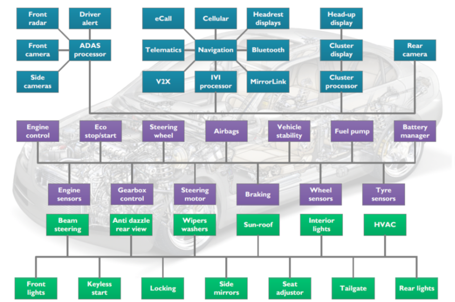
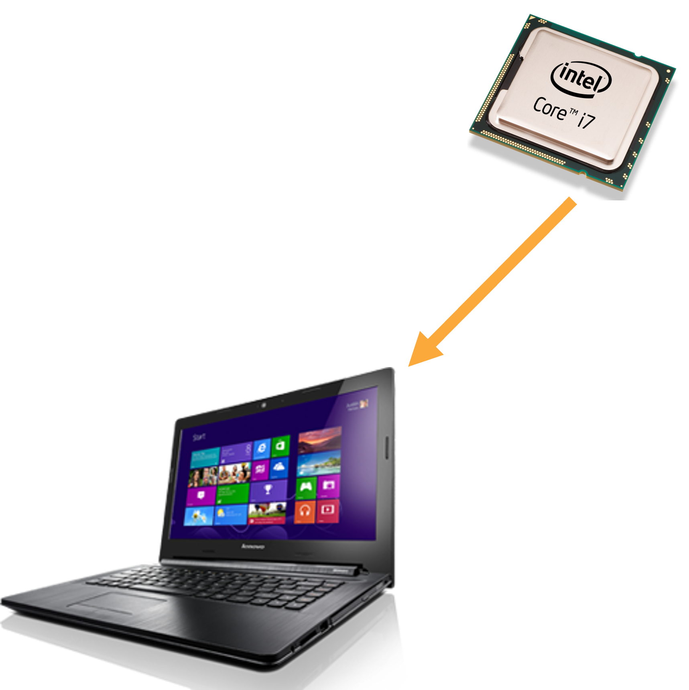
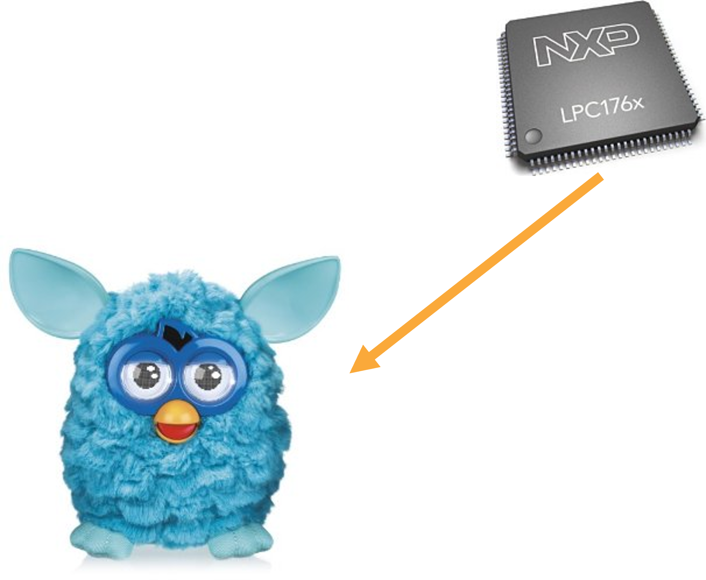
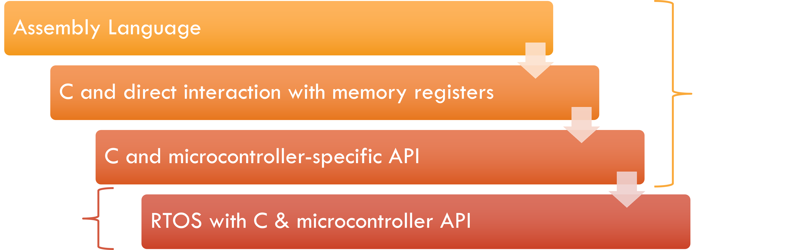
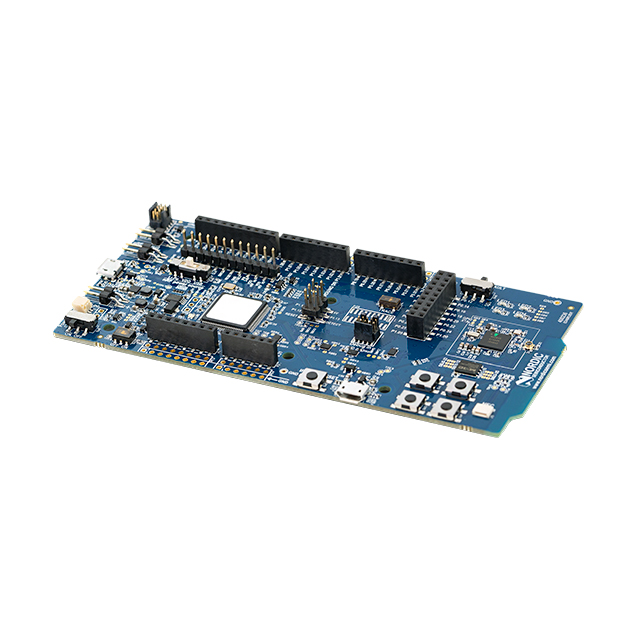
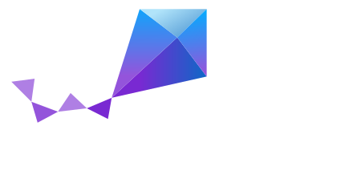

= Introduction to Embedded Systems: January 2025
:author: John M. Larkin <jlarkin@whitworth.edu>
:date: 2025-01-03
:docinfo: private
:experimental: 
:icons: font
:stem: latexmath
:source-highlighter: highlight.js
// Local development version
:revealjsdir: ..
// Github-hosted version
// :revealjsdir: ../../node_modules/reveal.js
:revealjs_width: 1920
:revealjs_height: 1080
:revealjs_theme: night
:revealjs_controls: true
:revealjs_controlsLayout: edges
:revealjs_controlsTutorial: true
:revealjs_hash: true

== What is an embedded system?
An embedded system is a device that has some type of electronic logic that allows the device to **respond to the environment**.

== What tasks do the logic devices inside of a modern car do?
[%step]

== What are other examples of embedded systems?

== Common features of embedded systems
[%hardbreaks]
[%step]
icon:coins[set=fas] Low cost
[%step]
icon:bolt[set=fas] Low power
[%step]
icon:snowflake[] Reliable in harsh environments
[%step]
icon:running[set=fas] Responds quickly to events
[%step]
icon:car-crash[set=fas] Handles faults without crashing
[%step]
icon:stopwatch[set=fas] Performs well-defined task that repeats

== Types of embedded systems

[frame=ends]
|===
| Implementation | Type | Design Cost | Unit Cost | Upgrades & Bug Fixes

| Discrete logic | HW | Low | Medium | Difficult

| ASIC | HW | Very high ($500k+) | Very low | Difficult

| FPGA | HW | Low to medium | Medium | Easy

| Microprocessor | HW+SW | Low to medium | Medium | Easy

| [.step.highlight-blue]#Microcontroller# | HW+SW | Low | Low to medium | Easy

| Embedded PC | HW+SW | Low | High | Easy
|===

[.columns]
== What is a microprocessor?
[.column]
--
* It is an integrated circuit (IC)
* It has a central processing unit (CPU) that
** Performs logical and arithmetic operations
** Has instructions for accessing memory and other outside connections
--

[.column]

[.columns]
== What is a microcontroller?
[.column]
--
* It is an IC
* It has a CPU
* It also has integrated memory and peripherals such as
** Analog input
** Serial communication
** Timers
** Counters
* Integration reduces power and costs
--

[.column]

== What will we be doing in this course?
We will be using microcontrollers for:

* digital input and output
* analog input
* serial communication
** SPI
** I^2^C
* Event- and time-triggered tasks 

== What are the options for programming microcontrollers?

[%auto-animate]
[.columns]
== How will we be doing that?
[.column .has-text-left]
We will be using the Nordic Semiconductor nRF52840 DK development board.

[.column]

[%auto-animate]
[.columns]
== How will we be doing that?
[.column .has-text-left]
--
We will be using the Nordic Semiconductor nRF52840 DK development board.

[.text-left]
We will program it

[%step]
* using C
* with the **Zephyr RTOS**
* through Nordic Semiconductor's **nRF Connect SDK**
* in VS Code
* assisted with Nordic Semiconductor's **nRF Connect for VS Code** extension
--

[.column]

[.columns]
== A typical day in this course
[.column]
.During class
[%step]
--
* Short quiz over previous day's concepts
* Topic A
** Short lecture on A
** Lab exercises illustrating A
* Topic B
** Short lecture on B
** Lab exercises illustrating B
--

[.column]
.Outside of class
[%step]
--
* Complete short paper-based homework
* Work on programming assignment that explores concepts from that day at a deeper level
--

== What happens now?

. Go to https://www.embed-uni.com and find the Lab 1 guide.
. Complete sections 1 and 2.
. We will have another short lecture before section 3 of the lab.
