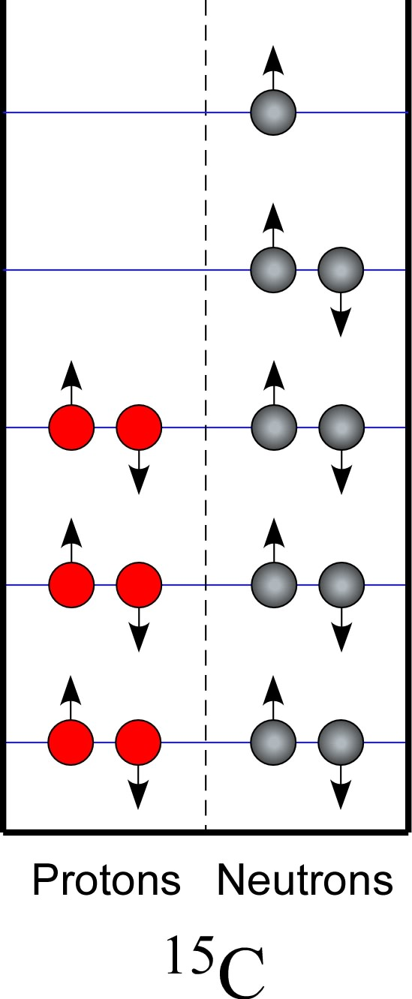
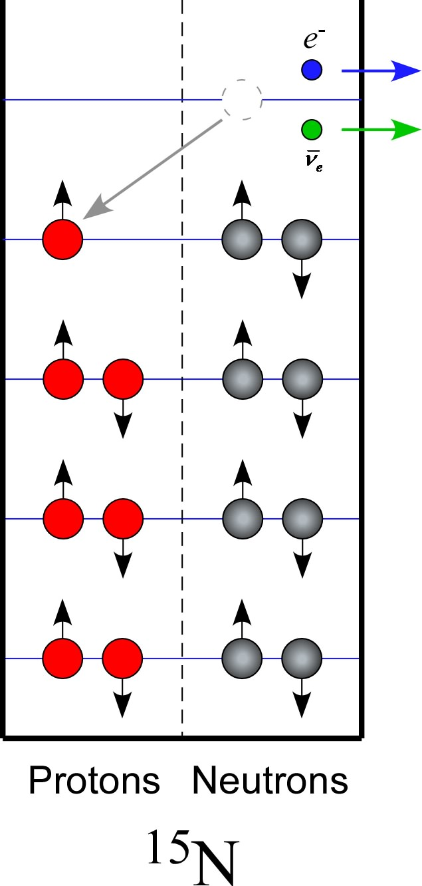
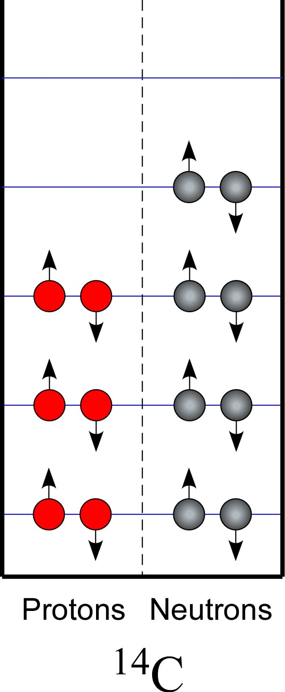
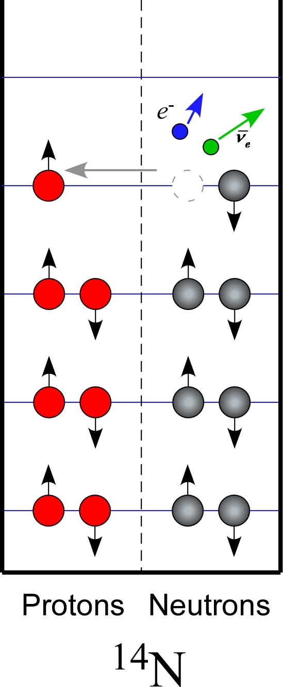
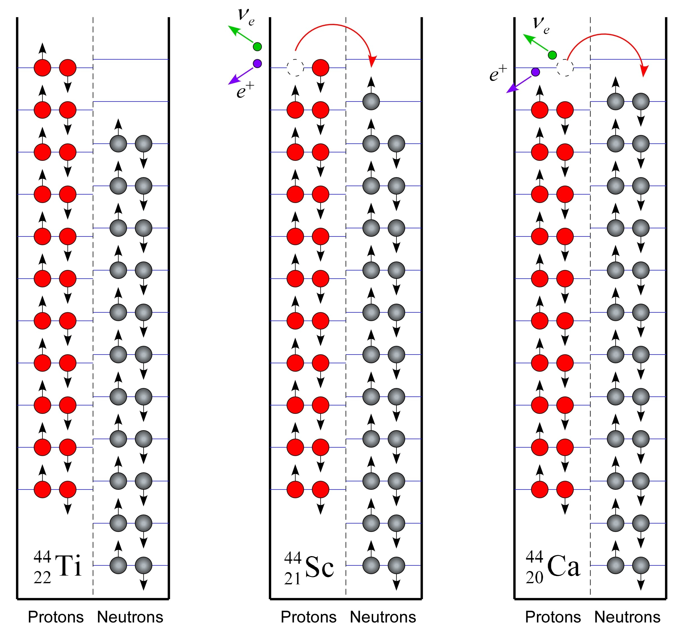
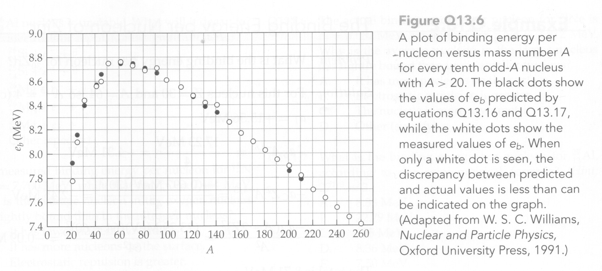

= Stable and Unstable Nuclei
:author: John M. Larkin <jlarkin@whitworth.edu>
:date: 2024-09-27
:docinfo: private
:experimental: 
:icons: font
:stem: latexmath
:revealjsdir: ../../node_modules/reveal.js
:revealjs_width: 1920
:revealjs_height: 1080
:revealjs_theme: sky
:revealjs_controls: true
:revealjs_controlsLayout: edges
:revealjs_controlsTutorial: true
:source-highlighter: highlight.js

[.columns]
== Key Questions
[.column]
--
image::chartofnuclei.gif[]
--

[.column]
--
[%step]
. Why aren't there stable nuclei composed entirely of protons or neutrons?
. Why do stable nuclei tend to have about the same number of protons as neutrons?
. Why do heavier stable nuclei tend to have more neutrons than protons?
. Why are there apparently no stable nuclei with  stem:[Z>83]?
. What makes unstable nuclei unstable and what are the mechanisms by which they transform themselves into stable nuclei?
--

[.columns]
== Fundamental forces and particles
[.column]
[background-color="white"]
// .**Fundamental Particles**
--
image::fundamentalparticles.png[]
--

[.column]
// .**Fundamental Forces**
--
* Gravitational
* Weak
* Electromagnetic
* Strong
--

[.columns]
=== Force overview

[.column]
.**Electromagnetic**
--
* Interaction between charged particles
* Long-range (drops like  stem:[1/r^2])
--

[.column]
.**Strong**
--
* Interaction between quarks
* Spring-like (grows with distance)
* Effective range is about 2 fm
--

[.column]
.**Weak**
--
* Affects both quarks and leptons
* Effective range is about 0.001 fm
--

[.degrade,transition="convex-in"]
=== Strong interaction binds
Quarks are never observed in isolation, but mostly come in pairs or triples.

* proton = uud
* neutron = udd

[.degrade,transition="convex-in convex-out"]
=== Weak interaction transforms
* The primary effect of the weak interaction is to transform:
** proton to neutron
** neutron to proton
* Usually also involves creation or absorption of neutrinos

[.columns]
[.degrade,transition="slide-in convex-out"]
=== Key weak-enabled transformations

[.column]
--
[stem]
.Neutron decay
++++
n \rightarrow e^- + p^+ + \bar{\nu}_e
++++

[stem]
.Proton decay
++++
p^+ \rightarrow n + e^+ + \nu_e
++++
--

[.column]
--
[stem]
.Electron capture
++++
p^+ + e^- \rightarrow n + \nu_e
++++
--

[.column]
--
[stem]
.Neutrino absorption
++++
\nu_e + n \rightarrow e^- + p^+
++++

[stem]
.Antineutrino absorption
++++
\bar{\nu}_e + p^+ \rightarrow n + e^+
++++
--

[.columns]
== Why is  stem:[N \approx Z]?

[.column]
--
image::carbon-12-model.jpg[height=864]
--

[.column]
.**Particle-in-a-box model of nucleus**
--
Pauli exclusion principle only allows two protons and two neutrons per energy level.
--

[.columns.is-vcentered]
=== Unbalanced nuclei transform

[.column]
--

--

[.column.fragment.is-one-fifth]
--
icon:arrow-right[4x]
--

[.column.fragment]
--

--

[.column.fragment.has-text-left]
--
Weak interaction allows a lower energy by transforming:

* protons to neutrons
* neutrons to protons
--

[.columns.is-vcentered]
=== Why does this occur?

[.column]
--

--

[.column.is-one-fifth]
--
icon:arrow-right[4x]
--

[.column]
--

--

[.column.fragment.has-text-left]
--
The mass of the proton is slightly less than that of neutron.

* stem:[m_p = 938.26\ \mathrm{MeV}/c^2]
* stem:[m_n = 939.55\ \mathrm{MeV}/c^2]
--

=== stem:[N \approx Z] because...
The Pauli exclusion principle and energy quantization imply that there can be a significant energy advantage to transforming excess neutrons to protons or excess protons to neutrons.

[IMPORTANT]
====
If a physical process that lowers a system's rest energy **can** take place, it eventually **will** take place.
====

[.columns]
== Why is  stem:[N>Z] for large nuclei?

[.column.is-one-fourth]
--
Electrostatic repulsion raises the energy levels for protons as the number of protons increases.
--

[.column]
--

--

[.columns]
== Semiempirical binding energy formula

[.column.has-text-left]
--
**Semiempirical** means this equation is a combination of

* theory
* scaling factors based on making it best fit experimental data
--

[.column.has-text-left]
--
[stem]
++++
E_b = E_I - E_S - E_C - E_A
++++

* stem:[E_I] -- interior binding term
* stem:[E_S] -- surface correction term
* stem:[E_C] -- Coulomb repulsion term
* stem:[E_A] -- Asymmetry term
--

[transition="convex-in convex-out", transition-speed=slow]
=== Interior binding term
This term accounts for the strong interaction between pairs of nucleons.

[stem]
++++
\begin{align*}
E_I & = \left(\mbox{number of nucleons}\right) \left( \frac{\mbox{bonds}}{\mbox{nucleon}}\right) \left( \frac{\mbox{energy}}{\mbox{bond}} \right) \\
  & = a_I A
\end{align*}
++++

[transition="convex-in convex-out",transition-speed=slow]
=== Surface correction term
Nucleons on the surface have fewer neighbors so too many bonds were included in the interior binding term. This is the correction factor.

[stem]
++++
\begin{align*}
E_S & = \left(\mbox{number of surface nucleons}\right) \left( \frac{\mbox{bond overcount}}{\mbox{surface nucleon}}\right) \left( \frac{\mbox{energy}}{\mbox{bond}} \right) \\
  & = a_S A^{2/3}
\end{align*}
++++

[transition="convex-in convex-out",transition-speed=slow]
=== Coulomb repulsion term
Every proton repels every other proton.

[stem]
++++
\begin{align*}
E_C & = \frac{1}{2} \sum\limits_{i=1}^{Z} \sum\limits_{\begin{array}{c}j=1\\j \ne i\end{array}}^Z \frac{ke^2}{r_{ij}} \\
  & = \left(\mbox{number of proton pairs}\right) \left( \frac{ke^2}{r_\mathrm{avg}} \right) \\
  & = \frac{1}{2} Z(Z-1) \left( \frac{ke^2}{r_\mathrm{avg}} \right) \\
  & = a_C Z^2 A^{-1/3}
\end{align*}
++++

[transition="convex-in convex-out",transition-speed=slow]
[.columns]
=== Asymmetry term

[.column]
--
The quantization of energy levels and the limitations imposed by the Pauli exclusion principle have not been included in the other terms. Here we account for the cost of having unequal numbers of protons and neutrons.

[stem]
++++
\begin{align*}
E_A & = \left( \mbox{energy to move first pair} \right) + \left( \mbox{energy to move second pair} \right) + ... \\
  & = a_A \left( A - 2Z \right)^2 A^{-1}
\end{align*}
++++
--

[.column]
--
image::asymmetry-term-explained.png[]
--

[transition="convex-in convex-out",transition-speed=slow]
[.columns]
=== Parameters are determined by fitting to experimental data

[.column]
--
[stem]
++++
E_b = a_I A - a_S A^{2/3} - a_C Z^2 A^{-1/3} - a_A \left( A - 2 Z \right)^2 A^{-1}
++++
--

[.column]
--
[stem]
++++
\begin{align*}
a_I & = 15.56\ \mathrm{MeV}\\
a_S & = 17.23\ \mathrm{MeV}\\
a_C & = 0.697\ \mathrm{MeV}\\
a_A & = 23.285\ \mathrm{MeV}
\end{align*}
++++
--

=== Binding energy per nucleon
[stem]
++++
e_b = \frac{E_b}{A}
++++

=== Formula vs. data
[.stretch]

[background-color="black"]
== Test your understanding
image::question-mark-2492009_1920.jpg[canvas,size=contain]

[%auto-animate]
[.columns]
=== Question 1

[.column.has-text-left]
--
One detector for solar neutrinos uses a huge vat of carbon tetrachloride to absorb neutrinos. If a Cl-37 atom absorbs a neutrino, what will it become?

[upperalpha]
. Cl-38
. S-37
. Ar-37
. Ar-36
. other
--

[.column]
--
image::periodic-table-around-chlorine.png[]
--

[%auto-animate]
[.columns]
=== Question 1 (with answer)

[.column.has-text-left]
--
One detector for solar neutrinos uses a huge vat of carbon tetrachloride to absorb neutrinos. If a Cl-37 atom absorbs a neutrino, what will it become?

[upperalpha]
. Cl-38
. S-37
. Ar-37 icon:star[]
. Ar-36
. other
--

[.column]
--
image::periodic-table-around-chlorine.png[]

Neutrinos are associated with weak interactions.

The nucleus starts with 17 protons and 20 neutrons but if it absorbs a neutrino a neutron becomes a proton.
--

[%auto-animate%auto-animate-restart]
[.columns]
=== Question 2

[.column.has-text-left]
--
The He-6 nucleus is unstable. How will it decay?

[upperalpha]
. stem:[{}^6_3\mathrm{Li} + e^- + \bar{\nu}_e]
. stem:[{}^5_3\mathrm{Li} + e^- + \bar{\nu}_e]
. stem:[{}^6_3\mathrm{Li} + e^+ + \nu_e]
. stem:[{}^5_3\mathrm{Li} + e^-]
. stem:[{}^5_1\mathrm{H} + e^+ + \nu_e]
--

[%auto-animate]
[.columns]
=== Question 2 (with answer)

[.column.has-text-left]
--
The He-6 nucleus is unstable. How will it decay?

[upperalpha]
. stem:[{}^6_3\mathrm{Li} + e^- + \bar{\nu}_e] icon:star[]
. stem:[{}^5_3\mathrm{Li} + e^- + \bar{\nu}_e]
. stem:[{}^6_3\mathrm{Li} + e^+ + \nu_e]
. stem:[{}^5_3\mathrm{Li} + e^-]
. stem:[{}^5_1\mathrm{H} + e^+ + \nu_e]
--

[.column]
.**Explanation**
--
The nucleus starts with 2 protons and 4 neutrons. It can become lower energy by transforming a neutron to a proton.

Charge must be conserved so an electron also results.

Transforming n to p requires the weak interaction and this results in some type of neutrino. The electron is normal matter so we need some anti.
--

[%auto-animate%auto-animate-restart]
[.columns]
=== Question 3

[.column.has-text-left]
--
The Al-26 nucleus is unstable. How will it decay?

[upperalpha]
. stem:[{}^{26}_{14}\mathrm{Si} + e^- + \bar{\nu}_e]
. stem:[{}^{25}_{14}\mathrm{Si} + e^- + \bar{\nu}_e]
. stem:[{}^{26}_{12}\mathrm{Mg} + e^- + \bar{\nu}_e]
. stem:[{}^{26}_{12}\mathrm{Mg} + e^+ + \nu_e]
. stem:[{}^{27}_{12}\mathrm{Mg} + e^+ + \nu_e]
--

[%auto-animate]
[.columns]
=== Question 3 (with answer)

[.column.has-text-left]
--
The Al-26 nucleus is unstable. How will it decay?

[upperalpha]
. stem:[{}^{26}_{14}\mathrm{Si} + e^- + \bar{\nu}_e]
. stem:[{}^{25}_{14}\mathrm{Si} + e^- + \bar{\nu}_e]
. stem:[{}^{26}_{12}\mathrm{Mg} + e^- + \bar{\nu}_e]
. stem:[{}^{26}_{12}\mathrm{Mg} + e^+ + \nu_e] icon:star[]
. stem:[{}^{27}_{12}\mathrm{Mg} + e^+ + \nu_e]
--

[.column]
.**Explanation**
--
The original nucleus has 13 protons and 13 neutrons. It could move to either 12 protons and 14 neutrons **or** to 14 protons and 12 neutrons.

Protons have less mass but also repel each other. With this many protons, the repulsion is beginning to be more significant than the mass difference so it is better to have 12 protons.
--

[%auto-animate%auto-animate-restart]
[.columns]
=== Question 4

[.column.has-text-left]
--
The measured binding energy per nucleon for N-15 is 7.700 MeV, while that for O-15 is 7.464 MeV. Why is the average nucleon in the oxygen nucleus less tightly bound than in the nitrogen nucleus?

[upperalpha]
. It has fewer nucleons overall.
. It has more nucleons on the surface.
. It has greater electrostatic repulsion.
. The nucleus is more asymmetric.
. Other
--

[%auto-animate]
[.columns]
=== Question 4 (with answer)

[.column.has-text-left]
--
The measured binding energy per nucleon for N-15 is 7.700 MeV, while that for O-15 is 7.464 MeV. Why is the average nucleon in the oxygen nucleus less tightly bound than in the nitrogen nucleus?

[upperalpha]
. It has fewer nucleons overall.
. It has more nucleons on the surface.
. It has greater electrostatic repulsion. icon:star[]
. The nucleus is more asymmetric.
. Other
--

[%auto-animate%auto-animate-restart]
[.columns]
=== Question 5

[.column.has-text-left]
--
The measured binding energy per nucleon for Ne-20 is 8.032 MeV, while that for Ne-21 is 7.972 MeV. Why is the average nucleon in the larger nucleus less tightly bound than in the smaller nucleus?

[upperalpha]
. It has more nucleons on the surface.
. It has greater electrostatic repulsion.
. The nucleus is more asymmetric.
. Other
--

[%auto-animate]
[.columns]
=== Question 5 (with answer)

[.column.has-text-left]
--
The measured binding energy per nucleon for Ne-20 is 8.032 MeV, while that for Ne-21 is 7.972 MeV. Why is the average nucleon in the larger nucleus less tightly bound than in the smaller nucleus?

[upperalpha]
. It has more nucleons on the surface.
. It has greater electrostatic repulsion.
. The nucleus is more asymmetric.
. Other icon:star[]
--

[.column]
.**Explanation**
--
Certain _magic number_ are more stable than would be expected from the semi-empirical binding energy formula. This is similar to filled orbitals for atoms.

A class in nuclear physics would get into more sophisticated models that include those effects.
--

[background-color="black"]
== The End
